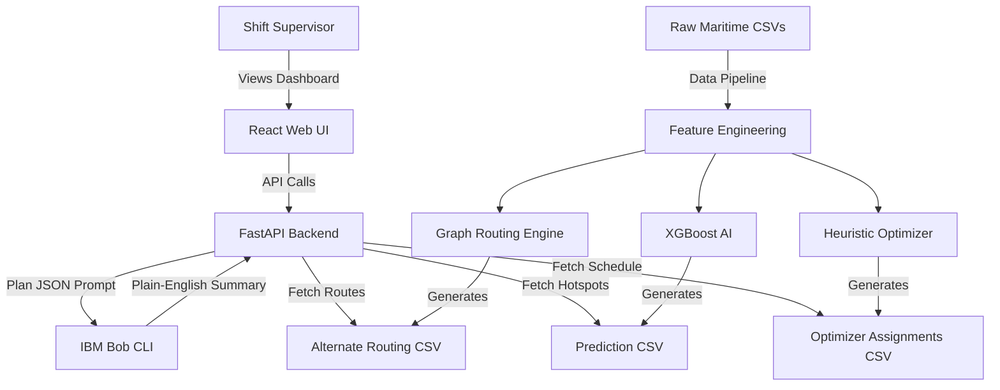

# Architecture

## Component Diagram

## Component Table

| Component | Technology | Responsibility |
| :--- | :--- | :--- |
| **Frontend UI** | React, Vite | Visualizes the dashboard, displays the 72-hour shift plan, and shows alternate routing recommendations. |
| **Backend API** | Python, FastAPI | Serves processed data to the frontend and acts as the orchestrator for the LLM integration. |
| **Prediction Engine** | Python, XGBoost | Trains on historical vessel ETAs and berth capacities to output daily congestion probability scores. |
| **Optimizer** | Python (Pandas) | A deterministic algorithm that schedules vessels to berths/cranes while strictly enforcing physical constraints. |
| **Routing Engine** | Python (Graph Math) | Calculates viability scores between connected ports to suggest the top 3 optimal detours. |
| **Explainability** | IBM Bob LLM CLI | Takes the numerical metrics from the backend and translates them into a 3-sentence summary for the supervisor. |

## Data Flow (End-to-End)
1.  **Offline Batch Processing:** Raw historical CSVs (`portcalls.csv`, `vessels.csv`, `berths.csv`, `segments_port2port.csv`) are ingested by our Python data pipeline. The XGBoost model predicts hotspots, the Optimizer schedules the ships, and the Routing Engine finds detours. The results are saved as static CSV databases in `data/processed/`.
2.  **API Serving:** The FastAPI backend spins up and instantly reads these pre-computed CSV databases.
3.  **LLM Augmentation:** When the API prepares the 72-hour operational plan payload for the frontend, it first passes a JSON summary of the plan to the IBM Bob CLI. Bob generates a human-readable text summary and appends it to the payload.
4.  **Client Visualization:** The React frontend receives the payload and renders the interactive graphs, tables, and the IBM Bob text summary.

## Scalability Notes
By strictly separating the heavy mathematical calculations (Offline Batch Processing) from the API Serving layer, our web dashboard is incredibly fast. The UI simply reads pre-computed CSVs and only makes a live inference call to IBM Bob, ensuring sub-second load times for the shift supervisor.
