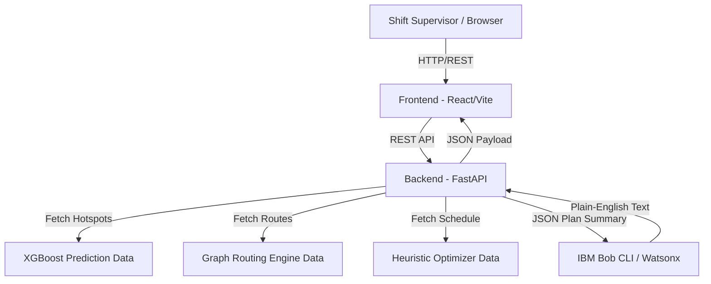

# Architecture

## System Architecture

The following diagram illustrates how data flows from the frontend dashboard through the FastAPI backend to the various offline processing models and the IBM Bob explainability layer.

## Components

| Component | Technology | Responsibility |
|---|---|---|
| Frontend | React 19, Vite, Tailwind | Interactive dashboard UI for 72-hour planning and visualization. |
| Backend API | FastAPI (Python) | Serving data, routing API requests, orchestration. |
| AI / Prediction | XGBoost, Scikit-Learn | Training on historical vessel data to predict port congestion. |
| Optimization | Python (Pandas/Heuristics) | Deterministic scheduling of vessels to berths and cranes. |
| Explainability | IBM Bob CLI (watsonx.ai) | Translating raw numerical probabilities into human-readable text. |
| Database | CSV Flat Files | Storing massive pre-computed model outputs for 1.48M vessels. |

## Data Flow

1. Offline data pipelines process raw maritime data (ETAs, berth counts) into structured features.
2. The XGBoost model predicts hotspots and the Optimizer schedules all vessels, saving results to static CSVs.
3. The React dashboard requests the 72-hour operational plan for a specific port via the FastAPI backend.
4. The backend loads the pre-computed CSV data and sends a JSON summary of the congestion metrics to the IBM Bob CLI.
5. IBM Bob returns a 3-sentence plain English summary, which the backend appends to the payload.
6. The frontend renders the complete dashboard, updating the maps, tables, and AI explanations.

## Security Considerations

- API keys (like `BOB_API_KEY`) are stored in `.env` files and never committed to git (ignored via `.gitignore`).
- Cross-Origin Resource Sharing (CORS) is configured on the FastAPI backend to securely restrict domains in production.
- Subprocess calls to the IBM Bob CLI use timeout protections to prevent deadlocks from malicious or malformed prompts.

## Scalability Notes

The architecture strictly separates heavy mathematical offline processing from real-time API serving. The FastAPI backend is entirely stateless and simply reads pre-computed static files, meaning it can be horizontally scaled infinitely behind a load balancer without performance degradation. The only bottleneck is the external API call to IBM Bob, which we mitigate using a robust local caching mechanism and deterministic fallback generators.
