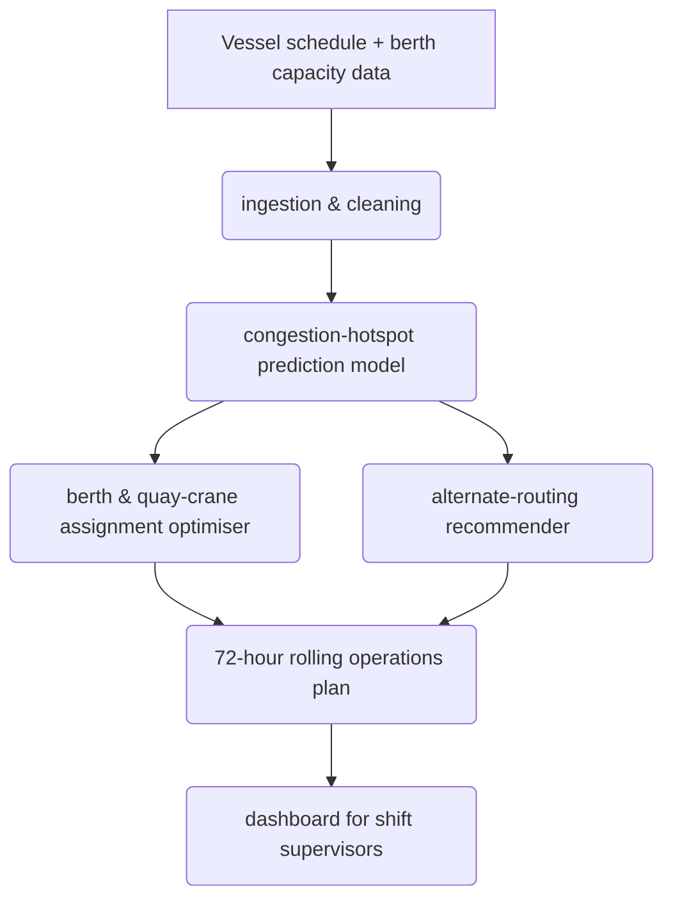

# Architecture

The PortFlow platform ingests raw schedule and capacity data, models future congestion, and optimizes assignments before presenting a comprehensive plan to the user. There are no unusual security or scalability concerns for this prototype scope, as it focuses on demonstrating the core predictive and optimization logic.

## Data Flow

Data moves through the system end-to-end starting with ingestion of vessel schedules and berth capacity. This data is fed into a prediction model that anticipates congestion hotspots. The optimizer then determines the best berth and crane assignments. When necessary, alternate routing recommendations are generated. Finally, all these insights are compiled into a 72-hour rolling operations plan, accessible to shift supervisors via the frontend dashboard.

## Component Flowchart

## Component Overview

| Component | Description |
|-----------|-------------|
| Ingestion & Cleaning | Prepares raw schedule and capacity data for modeling. |
| Prediction Model | Anticipates future port congestion based on incoming traffic and current capacity. |
| Optimizer | Assigns berths and quay-cranes to minimize vessel turnaround time. |
| Recommender | Suggests alternate routing for vessels likely to face significant delays. |
| Dashboard | A React-based UI that presents the 72-hour operations plan to shift supervisors. |
